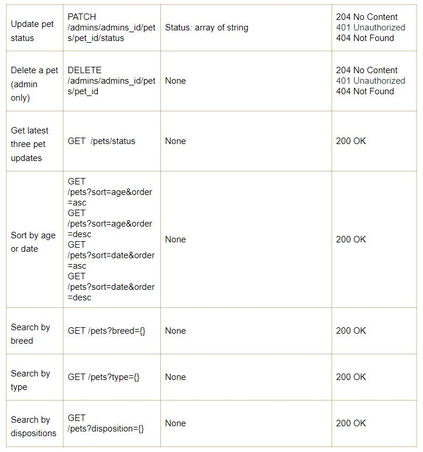

# waiting4u-backend

The “user” of our platform has two categories: admins from shelter and public users

Admin’s perspective

From the admin's perspective, he/she is able to register an admin account using the provided “registration code” and link. Once registered successfully, the admin will be login and redirected to the Admin Dashboard, where he/she is able to view, create, edit and delete a pet’s "dating" profiles that is initially created by him/her, with type of animal, breed, disposition, picture, availability, status, and description, etc. Moreover, the admin can update the latest animal status or news.

User’s perspective

From a user’s perspective, he/she is able to create and/or login an account and starts searching for a pet. At the landing page,the user can find the most recent updated animal news in a sliding carousel window. Under the carousel section, the user is able to search by applying one or multiple filters. On the Pets page, the user can view all the pets with sorting by different categories. What’s more, a user can save a pet to their favorite pet list by clicking on the heart icon on the pet’s profile. 

Upon successful registration and login, the user will be redirected to the User Dashboard, where they could manage their favorite pets in the wishlist and modify their profile and email preference. The user will receive email notifications about newly added pets based on their preferences. For example, if a user opts for weekly email preference, they will receive a notification every Friday with a list of new pets added during the last week.

The users are able to add a pet to the wishlist or remove it from the wishlist. Once they decide to apply to adopt a pet, or want to acquire more information, the users are expected to contact the admin by submitting a Contact Form on the AboutUs page. Only “available” pets are open for adoption applications. 

**RESTFUL API DESIGN:**

